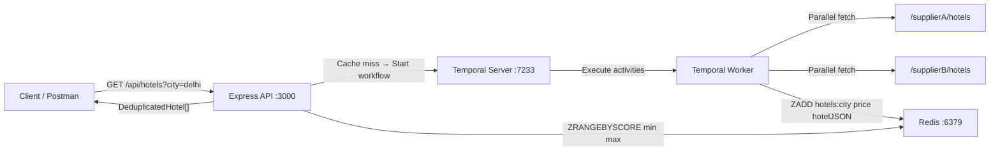

# 🏨 Hotel Offer Orchestrator

A hotel aggregation microservice that fetches offers from two mock suppliers in parallel, deduplicates them by cheapest price, caches results in Redis, and supports price-range filtering — all orchestrated via **Temporal.io**.

---

## Architecture



### Key Design Decisions

| Concern | Solution |
|---|---|
| Parallel supplier calls | `Promise.all` inside a Temporal workflow |
| Deduplication | Cheapest price per hotel name (case-insensitive) |
| Price filtering | Redis Sorted Sets + `ZRANGEBYSCORE` — filtering in Redis, not application code |
| Caching | 5-minute TTL on `hotels:<city>` sorted set |
| Resilience | Temporal retries each activity up to 3× with exponential back-off |

---

## Prerequisites

- [Docker](https://www.docker.com/) ≥ 24
- [Docker Compose](https://docs.docker.com/compose/) ≥ 2.20

---

## Quick Start

```bash
# 1. Clone the repo
git clone <repo-url>
cd Tripare-Hotel-Orchestrator

# 2. Build and start all 5 services
docker-compose up --build

# Services started:
#   http://localhost:3000  — Express API + mock suppliers
#   http://localhost:8080  — Temporal Web UI
#   redis on port 6379
#   Temporal gRPC on port 7233
```

> The first startup may take ~30–60 s for Temporal to initialise its schema.

---

## API Reference

### `GET /api/hotels`

Fetches the best-priced, deduplicated hotel list for a city.

| Parameter | Type | Required | Description |
|---|---|---|---|
| `city` | string | ✅ | City to search (e.g. `delhi`, `mumbai`) |
| `minPrice` | number | ❌ | Minimum price filter (inclusive) |
| `maxPrice` | number | ❌ | Maximum price filter (inclusive) |

**Example requests:**

```bash
# All hotels in Delhi
curl "http://localhost:3000/api/hotels?city=delhi"

# Delhi hotels priced between 5000 and 6000
curl "http://localhost:3000/api/hotels?city=delhi&minPrice=5000&maxPrice=6000"
```

**Success response (200):**

```json
[
  {
    "name": "Holtin",
    "price": 5340,
    "supplier": "Supplier B",
    "commissionPct": 20
  },
  {
    "name": "Radison",
    "price": 5900,
    "supplier": "Supplier A",
    "commissionPct": 13
  },
  {
    "name": "Trident",
    "price": 5600,
    "supplier": "Supplier B",
    "commissionPct": 7
  },
  {
    "name": "Taj",
    "price": 8500,
    "supplier": "Supplier A",
    "commissionPct": 8
  },
  {
    "name": "ITC Grand",
    "price": 7800,
    "supplier": "Supplier B",
    "commissionPct": 9
  }
]
```

**Error responses:**

| Status | Condition |
|---|---|
| `400` | `city` param missing or price params are not numbers |
| `500` | Temporal/Redis connection failure |

---

### `GET /supplierA/hotels?city=<city>`

Mock Supplier A — returns raw hotel offers (not deduplicated).

### `GET /supplierB/hotels?city=<city>`

Mock Supplier B — returns raw hotel offers with overlapping hotel names.

---

### `GET /health`

Reports health of all dependent services.

```bash
curl http://localhost:3000/health
```

**Response:**

```json
{
  "status": "healthy",
  "timestamp": "2026-09-10T16:00:00.000Z",
  "services": {
    "supplierA": { "status": "up", "latencyMs": 4 },
    "supplierB": { "status": "up", "latencyMs": 3 },
    "redis":     { "status": "up" },
    "temporal":  { "status": "up", "latencyMs": 12 }
  }
}
```

Returns `200` when all services are healthy, `503` when any service is degraded.

---

## Mock Data Overview

Both suppliers share overlapping hotel names (for meaningful deduplication):

| Hotel | Supplier A Price | Supplier B Price | Winner |
|---|---|---|---|
| Holtin | 6000 | **5340** | Supplier B |
| Radison | **5900** | 6100 | Supplier A |
| Marriott (Mumbai) | 7200 | **6800** | Supplier B |
| Leela (Mumbai) | **8800** | 8200 | Supplier B |
| Oberoi (Mumbai) | **9000** | 9500 | Supplier A |
| Taj | 8500 | — | Supplier A |
| ITC Grand | — | 7800 | Supplier B |
| Trident | — | 5600 | Supplier B |
| Holtin (Mumbai) | 4500 | — | Supplier A |

---

## Testing with Postman

1. Open Postman
2. **Import** → choose `postman/Hotel_Orchestrator.postman_collection.json`
3. The collection base URL is pre-set to `http://localhost:3000`
4. Run requests in the following order for a clean test:
   - **Health Check** — verify all services are up
   - **Supplier A / B direct** — sanity-check raw data
   - **Get Hotels — Delhi** — full dedup flow
   - **Get Hotels — Price Filter** — Redis filtering
   - **Get Hotels — No Results (Goa)** — empty response
   - **Missing city param** — 400 error

---

## Project Structure

```
Tripare-Hotel-Orchestrator/
├── src/
│   ├── server.ts                    # Express app entry point
│   ├── worker.ts                    # Temporal worker entry point
│   ├── activities/
│   │   └── hotelActivities.ts       # Fetch, dedupe, cache activities
│   ├── workflows/
│   │   └── hotelAggregation.ts      # Temporal workflow (parallel fetch → dedupe → cache)
│   ├── routes/
│   │   ├── hotels.ts                # GET /api/hotels
│   │   ├── suppliers.ts             # GET /supplierA/hotels, GET /supplierB/hotels
│   │   └── health.ts                # GET /health
│   ├── services/
│   │   └── redis.ts                 # Redis Sorted Set operations
│   ├── types/
│   │   └── hotel.ts                 # Shared TypeScript interfaces
│   └── data/
│       ├── supplierA.json           # Mock Supplier A data
│       └── supplierB.json           # Mock Supplier B data
├── postman/
│   └── Hotel_Orchestrator.postman_collection.json
├── Dockerfile                       # Multi-stage build
├── docker-compose.yml               # 5-service compose (Temporal, UI, Redis, API, Worker)
├── tsconfig.json
├── package.json
├── .env.example
└── README.md
```

---

## Temporal Workflow Details

```
hotelAggregationWorkflow(city)
  └── Promise.all([
        fetchSupplierHotels(supplierAUrl, "Supplier A", city),
        fetchSupplierHotels(supplierBUrl, "Supplier B", city)
      ])
  └── deduplicateHotels(hotelsA, hotelsB)
        → group by name (lowercase), pick cheapest per name
  └── persistToRedis(city, deduped)
        → ZADD hotels:<city> <price> <hotelJSON>
        → EXPIRE 300s
  └── return deduped[]
```

Each activity retries up to **3 times** with 500 ms initial back-off.

View workflow executions at **http://localhost:8080**.

---

## Redis Caching Strategy

| Operation | Redis Command |
|---|---|
| Cache hotel list | `ZADD hotels:<city> <price> <hotelJSON>` |
| Set expiry | `EXPIRE hotels:<city> 300` |
| Get all hotels | `ZRANGEBYSCORE hotels:<city> -inf +inf` |
| Filter by price | `ZRANGEBYSCORE hotels:<city> <min> <max>` |
| Cache existence check | `EXISTS hotels:<city>` |
